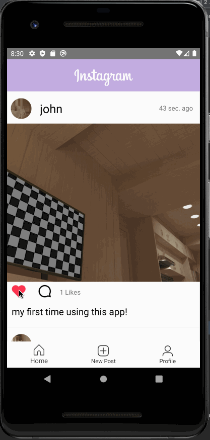
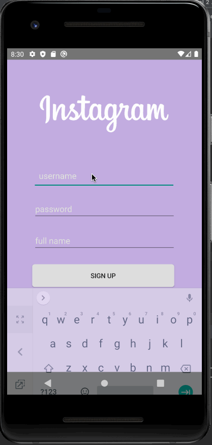
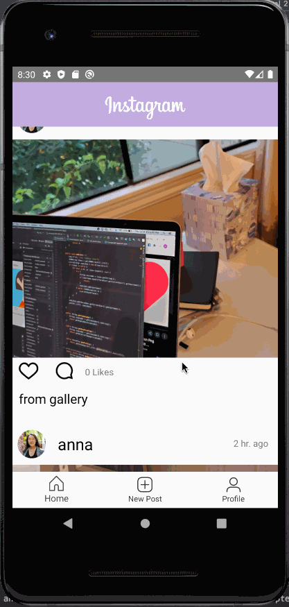
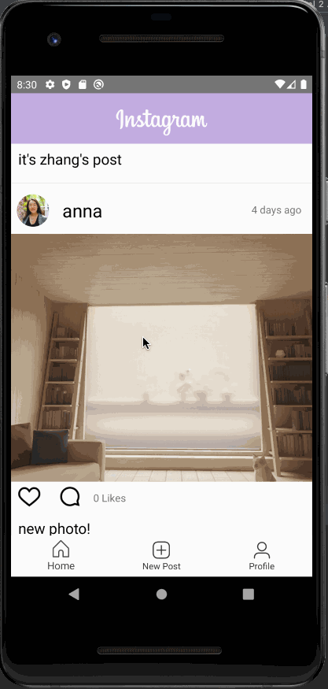
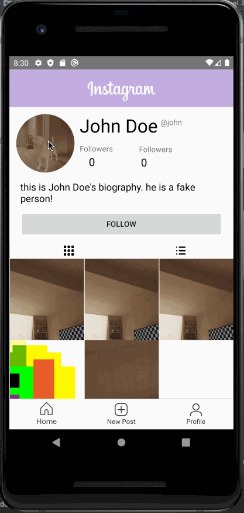
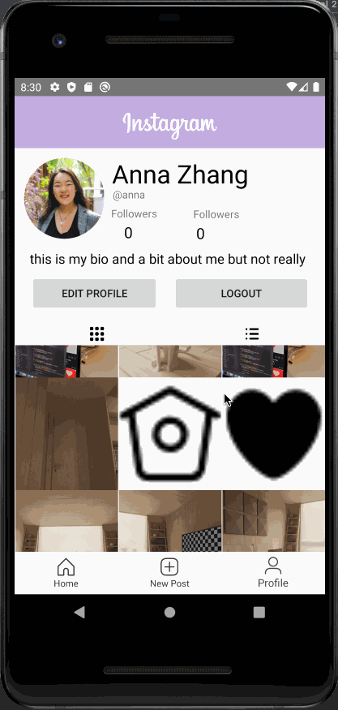
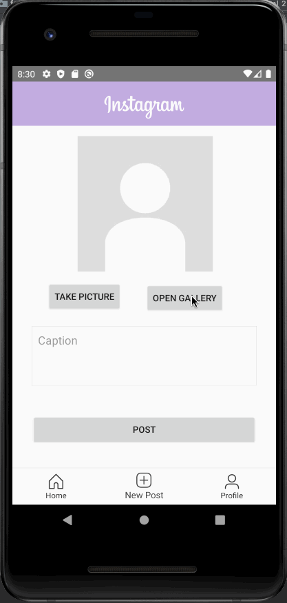

# Project 4 - *Parstagram*

**Parstagram** is a photo sharing app using Parse as its backend.

Time spent: **25** hours spent in total

## User Stories

The following **required** functionality is completed:

- [X] User sees app icon in home screen.
- [X] User can sign up to create a new account using Parse authentication
- [X] User can log in and log out of his or her account
- [X] The current signed in user is persisted across app restarts
- [X] User can take a photo, add a caption, and post it to "Instagram"
- [X] User can view the last 20 posts submitted to "Instagram"
- [X] User can pull to refresh the last 20 posts submitted to "Instagram"
- [X] User can tap a post to view post details, including timestamp and caption.

The following **stretch** features are implemented:

- [X] Style the login page to look like the real Instagram login page.
- [X] Style the feed to look like the real Instagram feed.
- [X] User should switch between different tabs - viewing all posts (feed view), capture (camera and photo gallery view) and profile tabs (posts made) using fragments and a Bottom Navigation View.
- [X] User can load more posts once he or she reaches the bottom of the feed using endless scrolling.
- [X] Show the username and creation time for each post
- [X] After the user submits a new post, show an indeterminate progress bar while the post is being uploaded to Parse
- User Profiles:
  - [X] Allow the logged in user to add a profile photo
  - [X] Display the profile photo with each post
  - [X] Tapping on a post's username or profile photo goes to that user's profile page
  - [X] User Profile shows posts in a grid view
- [X] User can comment on a post and see all comments for each post in the post details screen.
- [X] User can like a post and see number of likes for each post in the post details screen.

The following **additional** features are implemented:

- [X] User sees specific error message when Parse can't login or sign them up (i.e. Account with that username already exists, invalid password/username)
- [X] User profile shows a Name, username, bio, and profile picture as well
    - [X] Users can logout or edit their profile as well 
    - [X] Users can take a new profile picture
    - [X] Users can follows others from profile
    - [X] Users can toggle between grid and linear post views
- [X] User can see followers on any user's profile
- [X] Added followers and following numbers on each account 
- [X] Made the name property required, and if the user is signing up they see an additional field to enter their name
- [X] Created dialog fragment for when the user wants to create a comment 

Please list two areas of the assignment you'd like to **discuss further with your peers** during the next class (examples include better ways to implement something, how to extend your app in certain ways, etc):

1. I would like to talk about what the most efficient way to implement followers and following in the app
2. I would also be interested in discussing how we can implement a direct message chat feature to the app.

## Video Walkthrough

Here's a complete walkthrough of all implemented user stories:

Here are shorter gifs of various user stories: 

Login/Signup/Logout

Home feed (can like)

PostDetails (can comment)

User Profile (can follow, grid/list view)

Current User Profile (can edit profile)

Compose a new post (take picture and open gallery)

GIF created with [LiceCap](http://www.cockos.com/licecap/).

## Credits

List an 3rd party libraries, icons, graphics, or other assets you used in your app.

- [Android Async Http Client](http://loopj.com/android-async-http/) - networking library

## Notes

I had some difficulty when I was trying to implement the followers and following feature because I learned that you can not write information to other user's followers lists for instance if they are not the current user. Otherwise, I also had a bit of trouble getting the profile posts to display in a gridview, so I had to learn myself how to use the GridLayoutManager. 

## License

    Copyright [2020] [Anna Zhang]

    Licensed under the Apache License, Version 2.0 (the "License");
    you may not use this file except in compliance with the License.
    You may obtain a copy of the License at

        http://www.apache.org/licenses/LICENSE-2.0

    Unless required by applicable law or agreed to in writing, software
    distributed under the License is distributed on an "AS IS" BASIS,
    WITHOUT WARRANTIES OR CONDITIONS OF ANY KIND, either express or implied.
    See the License for the specific language governing permissions and
    limitations under the License.